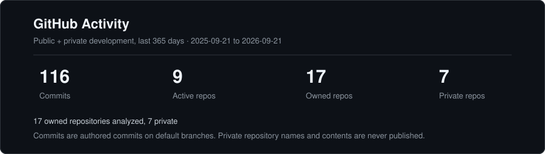

### MSc Computer Science · University of Copenhagen

#### Generative AI · Computer Vision · Machine Learning · Software Engineering

  <em>
    Building generative models, exploring medical AI, and turning ideas into working systems.
  </em>

 

 
 

**Expected graduation: 2027**

Interested in full-time ML Engineering, AI Software Engineering, and Research Engineering opportunities after summer 2027.

---

## About me

I'm a Computer Science master's student at the **University of Copenhagen** with a strong interest in **machine learning, generative AI, computer vision, and practical software engineering**.

Much of my research has focused on **3D diffusion models and medical imaging**, including controllable dental CBCT synthesis and counterfactual brain MRI reconstruction.

I'm the **first author of Tooth-Diffusion**, accepted at the **ODIN Workshop at MICCAI 2025** and published in Springer LNCS. I'm also a **co-author of CATCH**, developed for the **BraTS 2026 inpainting challenge**.

My bachelor's thesis explored guided 3D brain MRI generation, explainability, fairness, and counterfactual synthesis, and received the highest Danish grade, **12**.

Alongside research, I enjoy building practical software and expanding my engineering experience across backend systems, databases, mobile development, testing, CI, deployment, and modern AI-assisted development workflows.

I'm especially interested in the intersection between **research and engineering**, where strong ML ideas become reliable systems that people can actually use.

---

## Selected research & projects

<table>
<tr>

<td width="50%" valign="top">

<h3>🦷 Tooth-Diffusion</h3>

<strong>Guided 3D CBCT Synthesis with Fine-Grained Tooth Conditioning</strong>

  
  
  

Conditional 3D diffusion for controllable dental CBCT synthesis.

The framework combines wavelet-domain generation with tooth-level conditioning, enabling control over individual tooth presence and configuration.

Explored:

- Tooth addition
- Tooth removal
- Full dentition synthesis
- Conditional 3D generation
- Distributed PyTorch training

  <a href="https://arxiv.org/abs/2508.14276"><strong>Paper</strong></a>
  ·
  <a href="https://doi.org/10.1007/978-3-032-20711-1_9"><strong>Springer</strong></a>
  ·
  <a href="https://github.com/djafar1/tooth-diffusion"><strong>Code</strong></a>

</td>

<td width="50%" valign="top">

<h3>🧠 CATCH</h3>

<strong>Counterfactual Anatomical Tissue Inpainting with Conditional Haar Diffusion</strong>

  
  
  

Conditional 3D Haar-wavelet diffusion for healthy tissue reconstruction in brain MRI.

The model generates plausible tissue inside masked regions while preserving the observed anatomy outside the mask.

The selected pipeline was evaluated on the official **219-case BraTS 2026 validation set**.

  <a href="https://openreview.net/forum?id=FOlGqDQq9v"><strong>Manuscript</strong></a>
  ·
  <a href="https://github.com/simonwinther/brats2026"><strong>Code</strong></a>

</td>

</tr>

<tr>

<td width="50%" valign="top">

<h3>🎓 Bachelor's Thesis</h3>

<strong>Brain MRI Generation with Guidance and Explainability</strong>

  
  

Research into conditional 3D brain MRI generation using wavelet-based diffusion models.

The project explored:

- Demographic conditioning
- Image-based conditioning
- Counterfactual synthesis
- Explainability
- Fairness
- Medical image generation
- Model evaluation

Experiments were performed using **NVIDIA A100 GPUs**.

  <a href="https://github.com/djafar1/BachelorProject"><strong>Project & Code</strong></a>

</td>

<td width="50%" valign="top">

<h3>🔎 JobLens DK</h3>

<strong>Evidence-based CV and Job Matching</strong>

  
  
  

A practical NLP and software engineering project focused on connecting job requirements with evidence from a CV.

The project begins with classical NLP baselines and is designed to progressively explore:

- TF-IDF and cosine similarity
- Skill extraction
- Semantic retrieval
- ML evaluation
- SQL and persistence
- Grounded LLM explanations
- APIs
- Testing
- Docker
- CI/CD
- Deployment

  <a href="https://github.com/djafar1/joblens-dk"><strong>Project & Roadmap</strong></a>

</td>

</tr>
</table>

---

## Languages & tools

### Machine Learning & Research

  

Python · PyTorch · scikit-learn · NumPy · pandas · Diffusion Models · Computer Vision · Medical Imaging · Model Evaluation

### Software & Data

  

Git · Linux · Docker · PostgreSQL · SQL · Flask

### Application Development

  

React Native · TypeScript · Expo · npm · Supabase

### Additional Programming Experience

  

C · C++ · C# · F# · Bash · .NET

<strong>More about my technical experience</strong>

 

| Area | Experience |
| :--- | :--- |
| **Primary language** | Python |
| **ML & Deep Learning** | PyTorch, scikit-learn, NumPy, pandas |
| **Generative AI** | Diffusion models, conditional generation, inpainting, wavelet-based models |
| **Computer Vision** | 3D medical imaging, MRI, CBCT |
| **GPU Computing** | CUDA-based PyTorch workloads, NVIDIA A100 training |
| **Backend & Data** | Flask, PostgreSQL, SQL, Supabase |
| **Mobile & Frontend** | React Native, TypeScript, Expo |
| **JavaScript Ecosystem** | npm, package scripts, testing, linting, type checking |
| **Testing** | pytest, Jest |
| **Development** | Git, Linux, Docker, GitHub Actions |
| **Other Languages** | C, C++, C#, F#, Bash |

My strongest experience is currently in **Python, machine learning, and AI research**.

I have also worked with the application development and software technologies above through university projects, research projects, work, and personal projects.

---

## GitHub Activity

  

  
    Aggregate activity across public and private repositories.
    Private repository names, source code, file paths, and commit messages are never exposed.
  

---

## What I'm interested in

I'm currently focused on strengthening both sides of my profile:

**Research**
- Generative AI
- Diffusion models
- Computer vision
- Medical AI
- Model evaluation
- Efficient ML systems

**Engineering**
- Production ML
- Backend development
- APIs
- Databases
- Testing
- CI/CD
- Deployment
- Reliable AI systems

My long-term goal is to work on technically challenging AI systems where I can combine **machine learning depth with strong software engineering**.

---

## Let's connect

I'm interested in research collaborations, ambitious AI projects, and full-time opportunities starting after summer 2027.

 
 

<strong>Research · Engineering · AI</strong>

 
 

